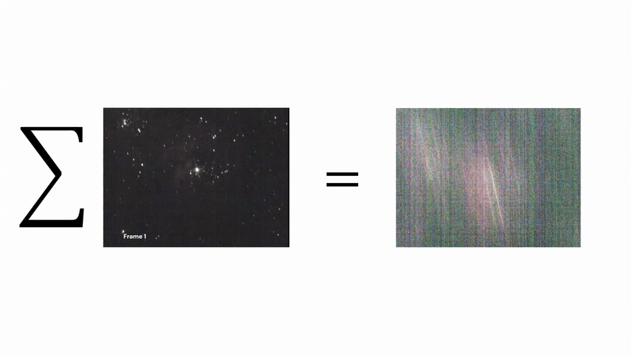
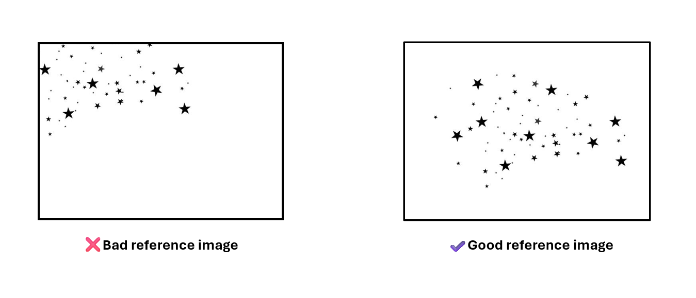
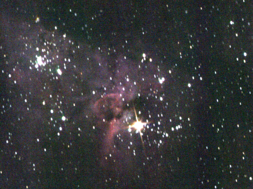

# No Tracker? No Problem
## A simple method of using phase cross correlation in Python to align and process deep-sky images for stacking when a tracking mount is not available

Visual astronomy and astrophotography are expensive hobbies. I understand that because, to put it buntly, I'm a broke Uni student (for now) that simply can't afford expensive equiment such as a $3000 heavy duty tracking mount for my Celestron telescope. So when I wanted to take long-exposure images of some of the night sky's most magnificant wonders, I needed to find a way as a Software Engineering student to come up with a simple and reliable way of aligning those images in preperation for stacking. If you have a good equatorial tracking mount, then you don't need to follow this method since your hardware does all the hard work for you. Of course you'll always get better cleaner results with a heavy duty tracking mount. If you are sitting there reading this and you're very confused about what I just said, don't worry. I'll explain what I mean with better clarity.

## The Problem
If you live on Planet Earth (not you Elon), and you look up at the night sky, you may see a few or many stars, the Moon, some planets that resemble stars, and/or the Milky Way strip. The visibility of each of these objects depends greatly on the level of atmospheric light pollution that is present in the specific location you are viewing from. In Western Sydney, where I live, the light pollution can be quite intense ([Bortle 7](https://en.wikipedia.org/wiki/Bortle_scale), to be specific). So, without optical aid, I can only see a handful of stars, the bright planets and the Moon.

With a telescope, the visibility of the aforementioned objects is greatly improved. However, a problem still remains: The universe is huge, and many deep-sky objects such as [Nebulae](https://en.wikipedia.org/wiki/Nebula), [Galaxies](https://en.wikipedia.org/wiki/Galaxy) and [Star Clusters](https://en.wikipedia.org/wiki/Star_cluster) are really, really far away. This makes seeing them even with a telescope challenging, particularly under light-polluted skies. While you may see the bright nebulas fairly easily with the eye through the telescope, such as [Orion Nebula](https://en.wikipedia.org/wiki/Orion_Nebula) or [Carina Nebula](https://en.wikipedia.org/wiki/Carina_Nebula), their faint details are best observed by taking long-exposure images using a camera attached to the telescope.  But if you own a telescope that is held on a manual mount, yet another issue is introduced: The effect of Earth's rotation is also magnified in the field of view, so each second you take an image through the telescope, the object has 'drifted' somewhat across the field of view. The object is **'misaligned'** across several images. 

So, if you try stacking these misaligned images, you essentially get a smudge. This illustration on [Carina Nebula](https://en.wikipedia.org/wiki/Carina_Nebula), which is what I worked on, shows you what that looks like:

So how do we actually align the images so that the numpy median stacking functions produces the desired result - a clear, bright, detailed image of the nebula? This is where the idea of phase cross correlation comes in.

## The Solution

I won't go into the nitty-gritty details of phase correlation as it is mathsy and dull, so you can read more information [here](https://scikit-image.org/docs/0.25.x/api/skimage.registration.html#skimage.registration.phase_cross_correlation) and [here](https://en.wikipedia.org/wiki/Phase_correlation). But basically, the main idea is that given a reference image, the algorithm will 'shift' other similar images to match/align with the reference image by determining the relative offset of distinct features (distance between reference points). It is all included in the skimage Python library which we import into the program file. A few important points to be made here:

1) There are limitations to this method. Perhaps the biggest of which is the need for a distinct, sharp **reference point** within the image, such as a bright star. It can't just be any star though, because the algorithim uses a fairly naive object detection system which can easily mistaken similar reference points within the same image. For instance, if your image is an open star cluster, such as the [Pleiades](https://en.wikipedia.org/wiki/Pleiades), the algorithm may pick a star as a reference point, but since the stars in the [Pleiades](https://en.wikipedia.org/wiki/Pleiades) look similar, it will select different stars in the other images to align with the reference, leading to a mismatch. Therefore, an important requirement for this method is that there should be at least one distinguashable bright point of light within the image that is different to the other points of light in the image. In the left hand frameset in the GIF above, you can see that there is a bright centre yellow star (probably [Eta Carinae](https://en.wikipedia.org/wiki/Eta_Carinae)). It is bright and unique enough that the object detection algorithm can consistently pick up on it across each frame.
2) The reference image you choose is important. This is because the position of the object(s) in the reference image will be the same as the output image. For example, if you choose a reference image where the object is in the top right corner of the screen, then the final stacked image will also show the object in the top right corner. So, its best that we choose a reference image where the **object is as close to the center as possible**.

   

Once the images are aligned, they are then stacked using numpy's median stack functions. The image may turn out to be quite noisy and grainy, so we might want to stretch the contrast a little bit. 

First, the stacked imaged needs to have colour, so it is debayered using the GB2RGB bayer pattern. The particular pattern for debayering may vary accross camera hardware, so its best to consult yours to see which bayer pattern is best suited. Once colourise, we can stretch the histogram contrast accross the RGB channels to produce a better-looking, high contrast image.

And thats it! Not bad for a fully manual telescope.
